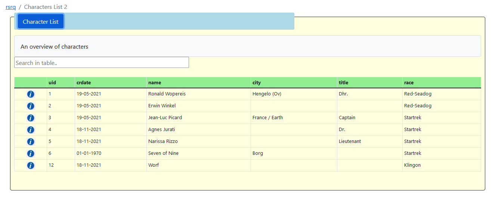

.. include:: ../../Includes.rst.txt

.. ==================================================
.. FOR YOUR INFORMATION
.. --------------------------------------------------
.. -*- coding: utf-8 -*- with BOM.

.. _characterslist:

Characters List
===============

Let's start with the list page. The first step is to create a new content element with the “RSRQ piquery” plugin record.

At this point we have to construct a query to retrieve the list of the fe_users which are not deleted and, for every character, 
the group name which the character belongs to. Use the tab "Database" to enter the following SQL in the Query field::

   SELECT
      fe_users.uid,
      fe_users.pid,
      fe_users.crdate,
      fe_users.name,
      fe_users.address,
      fe_users.title,
      fe_groups.title AS race

   FROM fe_users

   LEFT OUTER JOIN fe_groups ON fe_users.usergroup = fe_groups.uid

   WHERE fe_users.deleted = 0

vraag van rw
------------
>> vraag (RW) waarom is het veld columnNames verplicht?
>> ik heb columnNames even niet verplicht gesteld in rsrq en kijk wat er gebeur
>> -- this comment is to be removed at a later time --

Going to the “Results” tab, we can specify how many results per page we want, a text in case of no results, a summary and a caption to describe the results. 
Finally we can decide if we want to provide to the site users a link to download the results in a CSV format. 
The other tabs will be described in the following paragraphs, now save and close the content element.

vraag van rw
------------
ik zie hier de term "results tab" in de oorspronkelijke documentatie,
en Resultaten in onze extensie. wellicht handig om de oorspronkelijke naam
results tab te her/gebruiken?

If we open the “Characters list” page in the FrontEnd we'll see the list of fe_users records stored in our table (remember to insert at least one fe_users record if you want to see something :-)). Very easy!!!

Use default CSS styling
-----------------------

The extension provides some default styling that can be enabled in the flexform. 
In the tab "General" use the field "ID voor de div container [div_id]". Use the word "Listing" and you get a simple default styling for your (List)form.

   Apply some default styling
   
   
Also you can provide some extra information to have the output look nicer. F.i. apply a heading to your form with the field "Koptekst":
 

   Give your form a heading
   
Furthermore, when you fill in the field "Samenvatting" the heading in the form changes to a button. When you click this button a summary text is displayed beneath the header.
Clicking on the header(-button) again will hide the extra information. This feature works for bootstrap 4 and 5. 
You can use this to provice some extra information about the purpose of the table:
 

   
   Summary text of the table

The final result will look like this:

   The final result
   
