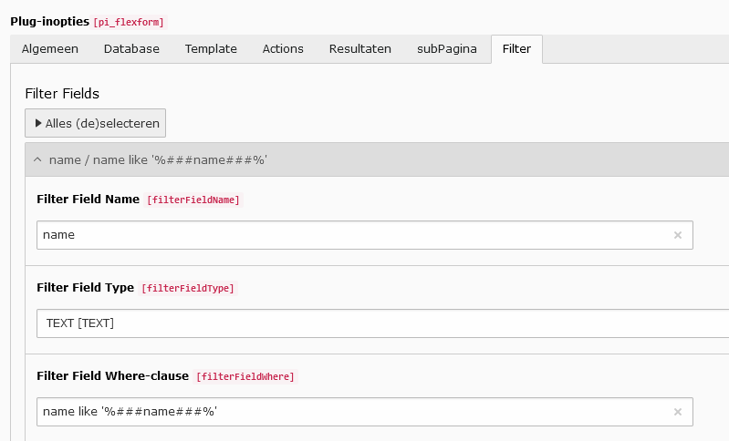
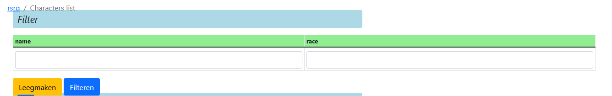
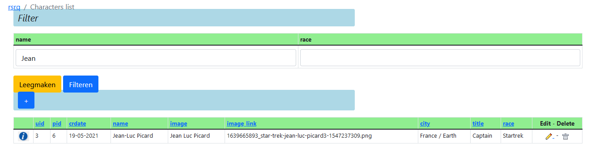

.. include:: ../../Includes.rst.txt

.. _filters:

Filters
=======

A filter is able to search only inside the results of the previously constructed query (or better, it's used to restrict the rows retrieved by an existing query). In our case it is the query in the database tab.

We want to permit our users to search for the characters whose name contains a particular string. 
For example, if a user searches for “he”, the query has to retrieve two characters: the doctor Beverlie Crusher and the Commander William Richer (Number 1 for the Captain ;-)). 
To do this we have to modify the query to obtain the following SQL::

   SELECT fe_users.uid, fe_users.name, fe_users.address, fe_users.title, fe_groups.title AS race 
   FROM ( fe_users LEFT OUTER JOIN fe_groups ON fe_users.usergroup = fe_groups.uid ) 
   WHERE ###filterFields### AND fe_users.deleted = 0 ORDER BY fe_users.name ASC

In order to activate the filter, go to the filter tab.
Add a new filter field by pressing the plus sign.

*  Filterfieldname: name
*  Filterfieldtype: TEXT
*  Filterfieldwhere: name LIKE '%name%'
   
and save the content element. It should look something like this:

   Create a filter
   
If one or more filters have been created, automatically a Filter Form is shown above the table output in the FrontEnd.

   Generated List Form with Filter section
   
You can type in any character in the field en press :kbd:`Enter` or press the Filter button. 
The output of the query is filtered:

   Filter result
   
To clear the fields of the Filter Form, just press the "Leegmaken" button.
