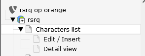

.. include:: ../../Includes.rst.txt

.. ==================================================
.. FOR YOUR INFORMATION
.. --------------------------------------------------
.. -*- coding: utf-8 -*- with BOM.

.. _usersmanual:

Users Manual
============

In this chapter of the manual we are going to see how to setup a database management tool in the FrontEnd. This is only a simple example of what you can obtain with this extension.
First let's describe what we are going to do. We want to provide to the website users the possibility to see the list of the characters of our preferred telefilm, 
to search for the preferred character, to see a detailed page for each character, to insert a new character, edit an existing character and to delete an existing character from the database.
First of all we have to configure the plugin (see “Administration” chapter) and then the first step is to create the page tree:

   Database Startrek - Pagetree

As you can see we have to create 3 pages. 

In the "Characters list" page we are going to store the list output of the query and thus display the characters. The visitors of our website can see this list of characters.
Every character is stored in the fe_users table and has a relation with the fe_groups table where the groups are stored (in our example every group represents a race and each race can have a number of characters).

The “Detail view” page is the page where it's possible to see the details of the individual characters. The Detail View form is automatically created when you fill in the PID of the Detail page.
An information symbol is automatically placed at the beginning of each line in the List View with a link to the Detail View page.
If you pay attention to the icon of the "Detail view" page, you'll notice that this page is a "not in menu" page, this is due to the fact that if you don't provide a character id, 
this page doesn't show anything, like the single page for the tt_news extension.

Finally, the "Edit / Insert" page provides the form to insert, edit and delete characters in the db. This is also a "not in menu" page.
In the following pages we'll see that it's possible to create these functionalities automatically without having a good knowledge of neither TypoScript nor PHP.

.. toctree::
   :maxdepth: 5
   :titlesonly:
   :glob:

   CharactersList/Index
   Filters/Index
   CUD/Index

